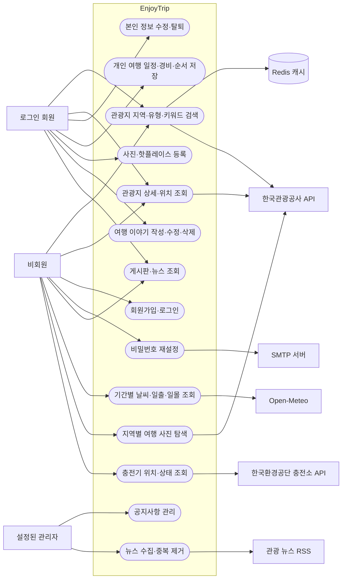

# Usecase Diagram

```mermaid
flowchart LR
    guest[비회원]
    member[로그인 회원]
    admin[설정된 관리자]
    tour[한국관광공사 API]
    redis[(Redis 캐시)]
    mail[SMTP 서버]
    feed[관광 뉴스 RSS]
    weatherApi[Open-Meteo]
    evApi[한국환경공단 충전소 API]
    subgraph EnjoyTrip
        search([관광지 지역·유형·키워드 검색])
        detail([관광지 상세·위치 조회])
        signup([회원가입·로그인])
        reset([비밀번호 재설정])
        profile([본인 정보 수정·탈퇴])
        plan([개인 여행 일정·경비·순서 저장])
        photo([사진·핫플레이스 등록])
        share([여행 이야기 작성·수정·삭제])
        read([게시판·뉴스 조회])
        notice([공지사항 관리])
        crawl([뉴스 수집·중복 제거])
        weather([기간별 날씨·일출·일몰 조회])
        gallery([지역별 여행 사진 탐색])
        chargers([충전기 위치·상태 조회])
    end
    guest --> search & detail & signup & reset & read & weather & gallery & chargers
    member --> search & detail & profile & plan & photo & share & read
    admin --> notice & crawl
    search --> redis
    search --> tour
    detail --> tour
    reset --> mail
    crawl --> feed
    weather --> weatherApi
    chargers --> evApi
    gallery --> tour
```

회원은 본인의 일정과 프로필에만 접근합니다. 게시판 수정/삭제는 작성자 또는 관리자에게 허용합니다. 공지 관리와 뉴스 수집은 `app.admin-emails`에 지정된 계정만 사용합니다.
